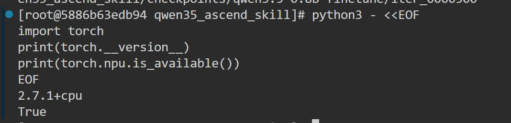
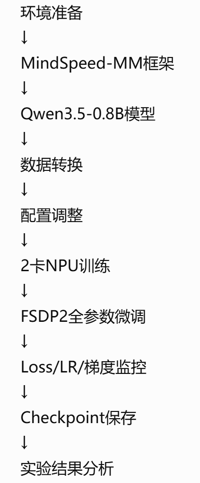
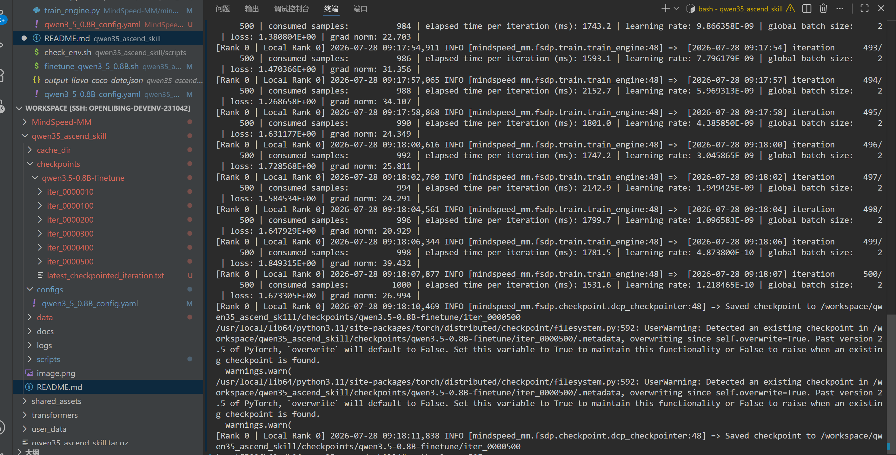
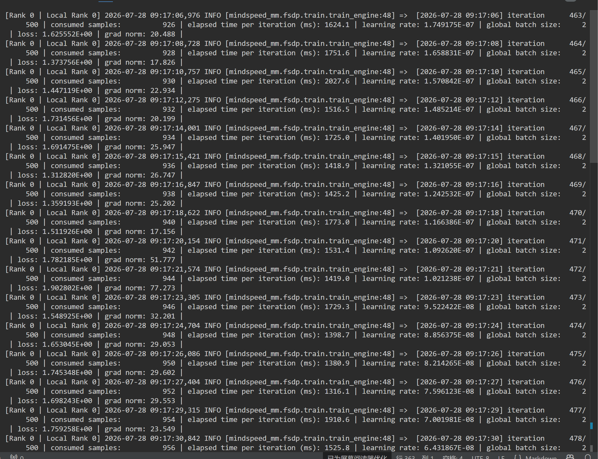

# Qwen3.5-0.8B Ascend NPU 全参数微调实验报告


## 1. 实验简介

本实验基于昇腾（Ascend）NPU 平台，使用 MindSpeed-MM 框架完成 Qwen3.5-0.8B 模型迁移部署，并验证基于 FSDP2 的多卡全参数微调流程。

本实验主要目标：

- 验证 Qwen3.5-0.8B 模型在 Ascend NPU 环境下正常运行；
- 验证 MindSpeed-MM 框架下 FSDP2 分布式训练流程；
- 验证 2 卡 NPU 环境下全参数微调能力；
- 验证训练过程中 loss、gradient、learning rate 正常变化；
- 验证 FSDP2 checkpoint 保存能力。


实验重点关注模型迁移与训练流程完整性，而非大规模预训练效果。


---

# 2. 实验环境


## 2.1 硬件环境



| 项目 | 配置 |
|---|---|
| 加速设备 | Ascend NPU |
| NPU数量 | 2 |
| 分布式训练 | torchrun |
| 并行方式 | FSDP2 |


## 2.2 软件环境


| 软件 | 配置 |
|-|-|
| Python | 3.11.6|
| PyTorch | 2.7.1+cpu |
| TorchNPU | 2.7.1.post4 |
| CANN | 9.1.0-beta.3 |
| MindSpeed-MM | 26.0.0 |

---

# 3. 模型信息


## 3.1 基础模型


模型：

```
Qwen3.5-0.8B
```


模型来源：

```
HuggingFace checkpoint
```


模型路径：

```
/workspace/MindSpeed-MM/ckpt/hf_path/Qwen3.5-0.8B
```


## 3.2 微调方式


训练方式：

```
Full Parameter Fine-tuning
```


本实验未采用 LoRA 等参数高效微调方式，而是进行全参数训练。


模型参数未冻结：

```yaml
# freeze:
#   - model.visual
```


语言模型和视觉模块均参与训练。


---

# 4. 数据集准备


## 4.1 数据来源


实验采用 LLaVA 格式多模态数据：


```
COCO2017
+
LLaVA-Instruct-150K
```


数据通过 MindSpeed-MM 数据转换工具转换。


输入数据：

```
data/coco
```

以及：

```
data/llava/llava_instruct_150k.json
```


输出：

```
data/output_llava_coco_data.json
```


## 4.2 数据格式


转换后的数据格式：


```json
{
    "images": [
        "./train2017/000000033471.jpg"
    ],
    "messages": [
        {
            "role": "user",
            "content": "<image>\nWhat are the..."
        },
        {
            "role": "assistant",
            "content": "The bus..."
        }
    ]
}
```


数据规模：

```
157712 samples
```
数据检查：



---

# 5. 训练配置


## 5.1 分布式训练配置


使用 2 张 Ascend NPU：

```bash
NPUS_PER_NODE=2
```


启动方式：

```bash
bash scripts/finetune_qwen3_5_0.8B.sh
```


实际调用：

```bash
torchrun \
--nproc_per_node 2 \
mindspeed_mm/fsdp/train/trainer.py
```


---

## 5.2 FSDP2配置


采用 Fully Sharded Data Parallel：


```yaml
parallel:
  fully_shard_parallel_size: auto
```


训练过程中：

- 模型参数进行分片；
- 梯度进行同步；
- 支持多卡 NPU 训练。


---

## 5.3 Batch配置


训练配置：


```yaml
micro_batch_size: 1

gradient_accumulation_steps: 1
```


实际：

```
global batch size = 2
```


即：


```
NPU0:
1 sample


NPU1:
1 sample


----------------

global batch:
2 samples
```


---

## 5.4 优化器配置


优化器：

```yaml
optimizer: adamw
```


开启：

```yaml
adam_fused: true
```


学习率：

```yaml
lr: 1.0e-5
```


学习率策略：

```yaml
lr_decay_style: cosine
```


---

# 6. 训练过程结果

训练配置：

```yaml
train_iters: 500
```


最终完成：

```
iteration 500 / 500
```


训练过程中日志示例：


```
iteration 463/500

loss: 1.625552

learning rate:
1.749175E-07

grad norm:
20.488
```


训练结束：


```
iteration 500/500

loss:
1.673305

grad norm:
26.994
```


训练过程中：

- learning rate 按 cosine 策略正常变化；
- grad norm 保持非零；
- loss 在不同 batch 之间存在波动。


说明：

模型参数参与正常更新，训练流程有效。


---




# 7. Loss变化分析


实验过程中 loss 并未持续单调下降，而是在一定范围内波动。


原因：

1. 多模态任务不同样本复杂度存在差异；
2. 当前实验主要用于验证迁移和训练链路；
3. 实际训练样本量较小；
4. cosine learning rate 后期降低，参数更新幅度减小。


本实验主要关注：


- forward 是否正常执行；
- backward 是否正常执行；
- gradient 是否产生；
- 参数是否更新；
- checkpoint 是否成功保存。


实验结果表明：

Qwen3.5-0.8B 已能够在 Ascend NPU 环境完成正常训练。


---

# 8. 性能测试


## 8.1 Iteration耗时


训练日志显示：


```
elapsed time per iteration

约 1200ms ~ 2000ms
```


示例：


| Iteration | Time(ms) | Loss |
|---|---|---|
|463|1624.1|1.625552|
|468|1418.9|1.312820|
|490|1477.7|1.194946|
|500|1531.6|1.673305|


---

## 8.2 吞吐


计算方式：

```
samples/s =
global batch size / iteration time
```


本实验：

```
global batch size = 2
```


平均吞吐：

```
约 1~1.5 samples/s
```


---

# 9. Checkpoint保存验证


训练过程中成功保存 FSDP2 checkpoint。


保存目录：


```
checkpoints/qwen3.5-0.8B-finetune/
```


保存节点：


```
iter_0000100

iter_0000200

iter_0000300

iter_0000400

iter_0000500
```


最终保存日志：


```
Saved checkpoint to

/workspace/qwen35_ascend_skill/checkpoints/qwen3.5-0.8B-finetune/iter_0000500
```


Checkpoint结构：


```
iter_0000500
|
├── .metadata
|
├── extra_state
|   |
|   ├── extra_state_rank_0.pt
|   └── extra_state_rank_1.pt
|
└── FSDP distributed model states
```


验证：

- FSDP2训练状态可以保存；
- 多卡状态同步正常；
- checkpoint生成成功。


---

# 10. 问题定位与解决


## 10.1 Invalid Device ID


问题：

```
Expected value: [0,2)
```


原因：

启动进程数超过实际 NPU 数量。


解决：

修改：

```bash
NPUS_PER_NODE=2
```


---

## 10.2 Triton算子依赖问题


问题：

```
ModuleNotFoundError:
No module named triton
```


原因：

优化算子依赖缺失。


解决：

关闭非必要融合算子：

```yaml
gdn_implementation: eager

causal_conv1d_implementation: eager
```


---

## 10.3 Meta device初始化问题


问题：

开启：

```yaml
init_model_with_meta_device: true
```


训练过程中无法正常更新。


解决：

关闭：

```yaml
init_model_with_meta_device: false
```


原因：

当前实验使用 HuggingFace checkpoint 直接加载，小规模模型无需 meta 初始化。


---

# 11. 实验总结


本实验完成了 Qwen3.5-0.8B 在 Ascend NPU 平台上的完整微调流程。


完成内容：

✅ Ascend NPU 环境部署

✅ Qwen3.5-0.8B模型加载

✅ COCO/LLaVA多模态数据接入

✅ FSDP2两卡训练

✅ 全参数微调验证

✅ Loss与Gradient正常输出

✅ FSDP checkpoint保存


实验结果证明：

基于 MindSpeed-MM 框架，Qwen3.5-0.8B 可以在昇腾 NPU 平台完成端到端全参数微调流程。


该实验流程可以进一步封装为自动化 Skill，实现：

- 环境检查；
- 模型迁移；
- 数据准备；
- 自动训练；
- 性能测试；
- 实验报告生成。
可以观察到：

## 实验结果

已完成：

- Qwen3.5-0.8B模型加载
- Ascend NPU运行
- FSDP2多卡训练
- 全参数微调
- checkpoint保存

实验详情：

见 docs/experiment_result.md
