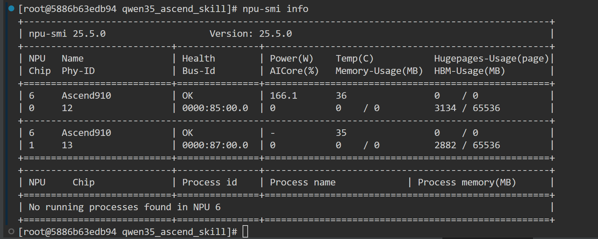
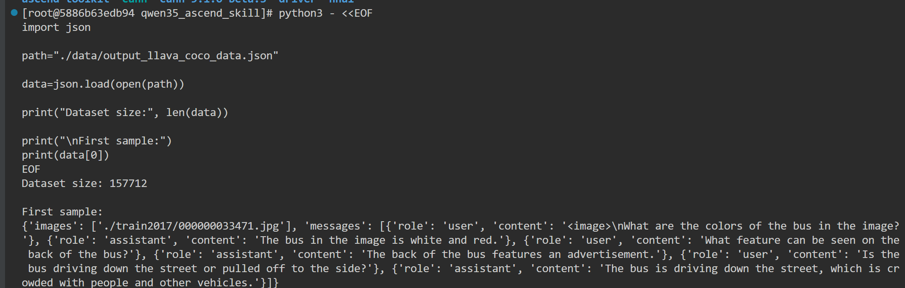
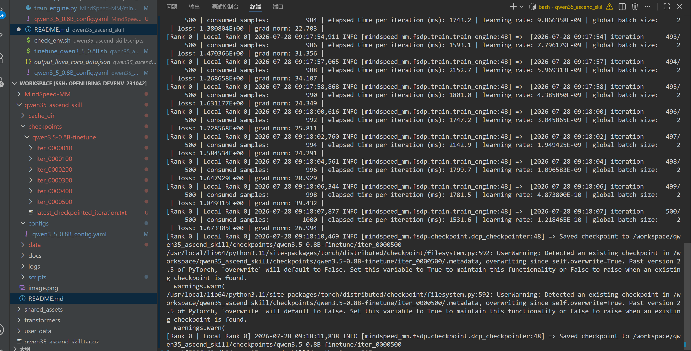
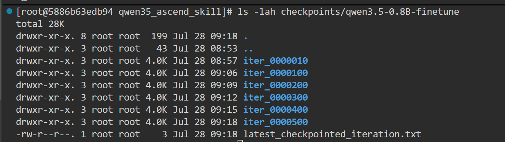
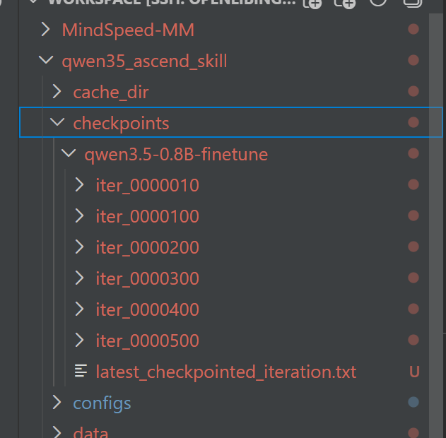
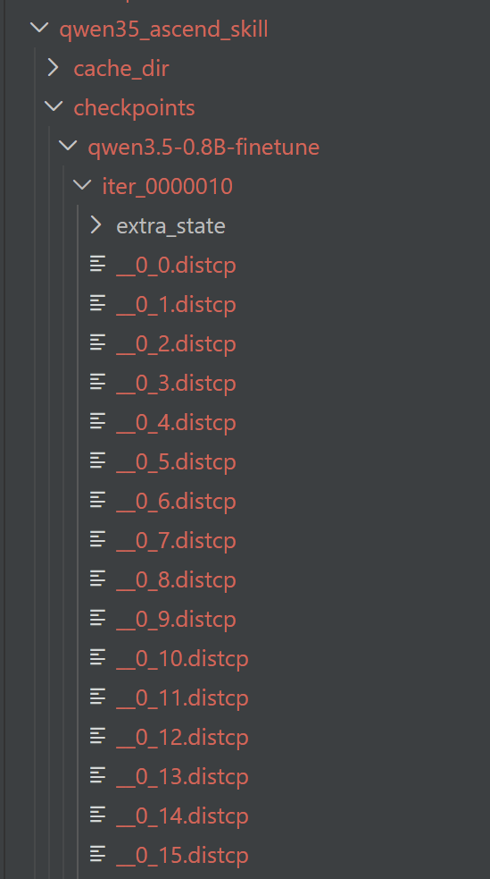

# Qwen3.5-0.8B Ascend NPU 全参数微调实验报告


## 1. 实验概述


本实验基于昇腾（Ascend）NPU 平台，使用 MindSpeed-MM 框架完成 Qwen3.5-0.8B 模型的迁移部署以及全参数微调验证。


实验目标：

- 验证 Qwen3.5-0.8B 模型可以在 Ascend NPU 环境正常运行；
- 验证 MindSpeed-MM + FSDP2 多卡训练流程；
- 验证模型参数能够正常更新；
- 验证 checkpoint 保存能力；
- 为后续自动化 Skill 封装提供实验基础。


本实验重点关注：

> 模型迁移流程完整性、训练链路可运行性以及工程复现能力。


---

# 2. 实验环境


## 2.1 硬件环境


| 项目 | 配置 |
|---|---|
| 加速设备 | Ascend NPU |
| NPU数量 | 2 |
| 分布式训练方式 | torchrun |
| 并行训练方式 | FSDP2 |


环境检查结果：



---

## 2.2 软件环境


| 软件 | 配置 |
|-|-|
| Python | 3.11.6|
| PyTorch | 2.7.1+cpu |
| TorchNPU | 2.7.1.post4 |
| CANN | 9.1.0-beta.3 |
| MindSpeed-MM | 26.0.0 |


---

# 3. 模型信息


## 3.1 基础模型


模型：

```
Qwen3.5-0.8B
```


模型来源：

```
HuggingFace checkpoint
```


模型路径：

```
/workspace/MindSpeed-MM/ckpt/hf_path/Qwen3.5-0.8B
```


---

## 3.2 微调方式


训练方式：

```
Full Parameter Fine-tuning
```


本实验未使用 LoRA。


未开启参数冻结：

```yaml
# freeze:
#   - model.visual
```


因此：

- 视觉模块参与训练；
- 语言模型参数参与训练；
- 所有参数均参与梯度更新。


---

# 4. 数据准备


## 4.1 数据来源


实验采用 LLaVA 格式多模态训练数据。


数据来源：

```
COCO2017

+

LLaVA-Instruct-150K
```


经过数据转换后生成：


```
data/output_llava_coco_data.json
```


---

## 4.2 数据格式


转换后的数据格式：


```json
{
    "images": [
        "./train2017/000000033471.jpg"
    ],
    "messages": [
        {
            "role": "user",
            "content": "<image>\nWhat are the..."
        },
        {
            "role": "assistant",
            "content": "The bus..."
        }
    ]
}
```


数据规模：

```
157712 samples
```


数据检查：




---

# 5. 训练配置


## 5.1 分布式配置


训练采用 2 张 Ascend NPU：


```bash
NPUS_PER_NODE=2
```


启动命令：

```bash
bash scripts/finetune_qwen3_5_0.8B.sh
```


实际调用：


```bash
torchrun \
--nproc_per_node 2 \
mindspeed_mm/fsdp/train/trainer.py
```


---

## 5.2 FSDP2配置


采用 Fully Sharded Data Parallel：


```yaml
parallel:
  fully_shard_parallel_size: auto
```


训练过程中：

- 模型参数进行分片；
- 多卡间同步梯度；
- 支持全参数微调。


---

## 5.3 Batch配置


训练配置：


```yaml
micro_batch_size: 1

gradient_accumulation_steps: 1
```


实际：

```
global batch size = 2
```


含义：

```
NPU0:
1 sample


NPU1:
1 sample


总计:
2 samples / iteration
```


---

## 5.4 优化器配置


优化器：

```yaml
optimizer: adamw
```


融合优化：

```yaml
adam_fused: true
```


学习率：

```yaml
lr: 1.0e-5
```


学习率策略：

```yaml
lr_decay_style: cosine
```


---

# 6. 训练过程结果


训练配置：

```yaml
train_iters: 500
```


训练过程中日志：


可以观察：

- iteration 正常递增；
- loss 正常输出；
- learning rate 按 scheduler 变化；
- grad norm 保持非零。


训练结束：


```
iteration 500/500
```


最终训练日志：


```
loss:
1.673305


grad norm:
26.994
```


训练完成截图：





---

# 7. Loss与参数更新分析


训练过程中 loss 并未持续单调下降，而是在一定范围内波动。


原因包括：


1. 多模态任务不同样本难度存在差异；
2. 当前实验主要目标是验证训练流程；
3. 数据规模和训练轮次有限；
4. cosine scheduler 后期学习率降低。


判断模型是否正常训练主要依据：


- learning rate 是否变化；
- gradient 是否产生；
- grad norm 是否非零；
- checkpoint 是否成功保存。


实验过程中：


learning rate：

```
0

↓

1e-5

↓

1e-10
```


grad norm：

```
持续非0
```


说明：

模型完成了：

```
Forward

↓

Backward

↓

Gradient Update
```


训练流程正常。


---

# 8. 性能测试


## 8.1 单步耗时


训练日志显示：


```
elapsed time per iteration
约 1200ms ~ 2000ms
```


示例：

```
iteration 500

elapsed time per iteration:
1531.6 ms
```


---

## 8.2 吞吐计算


计算公式：


```
samples/s =
global batch size / iteration time
```


本实验：


```
global batch size = 2
```


平均吞吐：


```
约 1~1.5 samples/s
```


---

# 9. Checkpoint保存验证


训练过程中成功保存 FSDP2 checkpoint。


保存目录：

```
checkpoints/qwen3.5-0.8B-finetune/
```


保存结果：


```
iter_0000100

iter_0000200

iter_0000300

iter_0000400

iter_0000500
```


保存日志：

```
Saved checkpoint to

/workspace/qwen35_ascend_skill/checkpoints/qwen3.5-0.8B-finetune/iter_0000500
```


Checkpoint截图：





checkpoint结构：


```
iter_0000500

├── .metadata

├── extra_state
│
├── extra_state_rank_0.pt
│
└── extra_state_rank_1.pt
```


验证：

- FSDP2训练状态可以保存；
- 多卡训练状态正常同步；
- checkpoint生成成功。


---

# 10. 遇到的问题与解决


## 10.1 Invalid Device ID


问题：

```
Expected value: [0,2)
```


原因：

启动进程数量超过实际 NPU 数量。


解决：

修改：


```bash
NPUS_PER_NODE=2
```


---

## 10.2 Triton依赖问题


问题：


```
ModuleNotFoundError:
No module named triton
```


原因：

部分优化算子依赖 Triton。


解决：


关闭非必要优化算子：


```yaml
gdn_implementation: eager

causal_conv1d_implementation: eager
```


---

## 10.3 Meta Device初始化问题


问题：

开启：

```yaml
init_model_with_meta_device: true
```


训练过程中无法正常更新参数。


解决：

关闭：


```yaml
init_model_with_meta_device: false
```


原因：

当前实验使用 HuggingFace checkpoint 直接加载，小规模模型无需使用 meta device 初始化。


---

# 11. 实验总结


本实验完成了 Qwen3.5-0.8B 在 Ascend NPU 平台上的完整微调流程。


完成内容：


✅ Ascend NPU环境部署

✅ Qwen3.5-0.8B模型加载

✅ COCO/LLaVA多模态数据接入

✅ FSDP2双卡训练

✅ 全参数微调验证

✅ Loss、Learning Rate、Gradient验证

✅ Checkpoint保存验证


实验结果证明：


基于 MindSpeed-MM 框架，

Qwen3.5-0.8B 可以在昇腾 NPU 平台完成端到端全参数微调流程。


该实验为后续自动化 Skill 封装：

- 模型迁移；
- 自动训练；
- 性能测试；
- 实验报告生成；

提供了基础。

